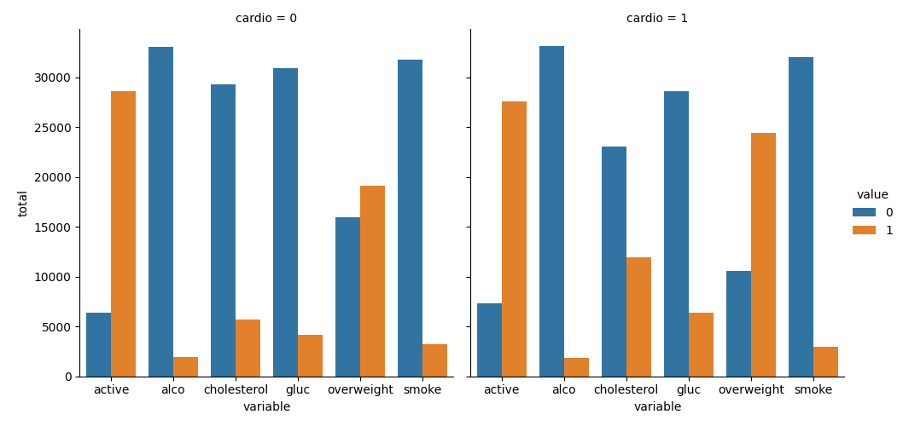
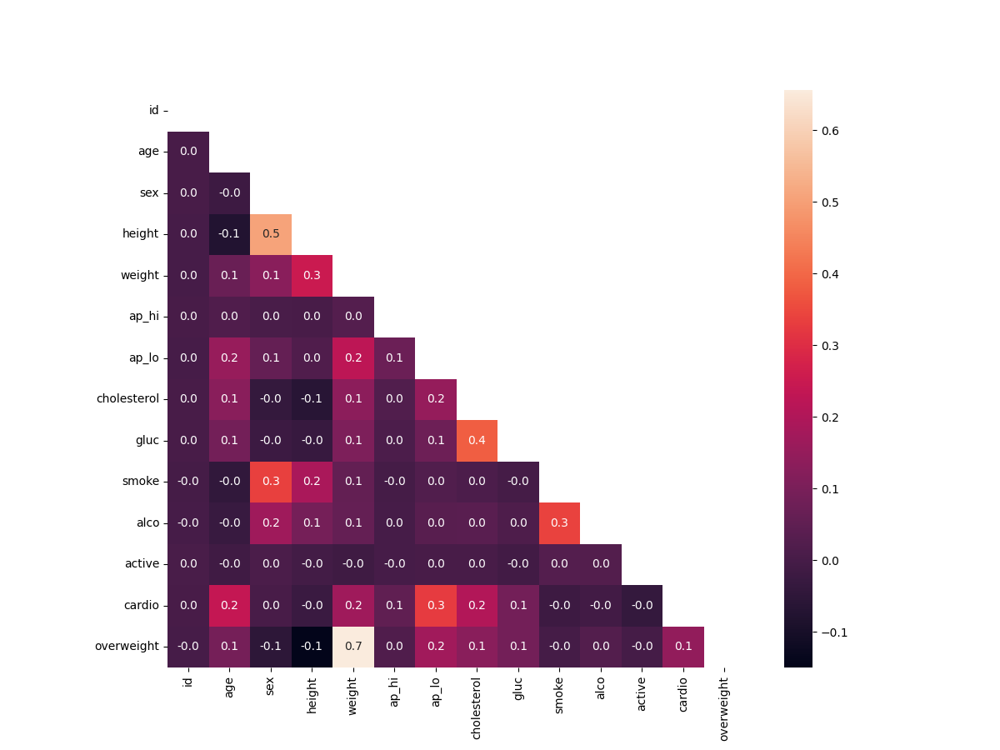

# Medical-Data-Visualizer
This project is part of the freeCodeCamp Data Analysis with Python. It visualizes and analyzes medical examination data using Pandas, Matplotlib, and Seaborn. The dataset contains information from various medical exams, including age, blood pressure, cholesterol levels, lifestyle choices, and the presence of cardiovascular disease. 

## Features
- **Data Cleaning & Transformation**: 
  - Add an **overweight** column based on BMI (Body Mass Index).
  - Normalize columns like **cholesterol** and **glucose** for better analysis.
  
- **Data Visualization**:
  - **Categorical Plot**: Shows the counts of features like **cholesterol**, **glucose**, **smoking**, and **physical activity** for patients with and without cardiovascular disease.
  - **Heatmap**: Visualizes correlations between various features such as age, weight, height, and blood pressure to better understand how they relate to heart disease.
  
- **Technical Stack**:
  - **Pandas**: For data cleaning, transformation, and manipulation.
  - **Matplotlib & Seaborn**: For creating visualizations such as categorical plots and heatmaps.
  
- **Analysis Focus**:
  - Identifying patterns related to cardiovascular disease risk factors.
  - Visualizing distributions of key features for both healthy and at-risk populations.

## Project Files
- **`medical_data_visualizer.py`**: Contains the main code for data cleaning, transformation, and visualization.
- **`medical_examination.csv`**: The dataset containing medical examination data.
- **`cat_plot.png`**: Output of the categorical plot showing feature distributions for the cardio vs non-cardio groups.
- **`heatmap.png`**: Output of the heatmap showing correlations between features.

## Visualizations
### Categorical Plot

### Heatmap

